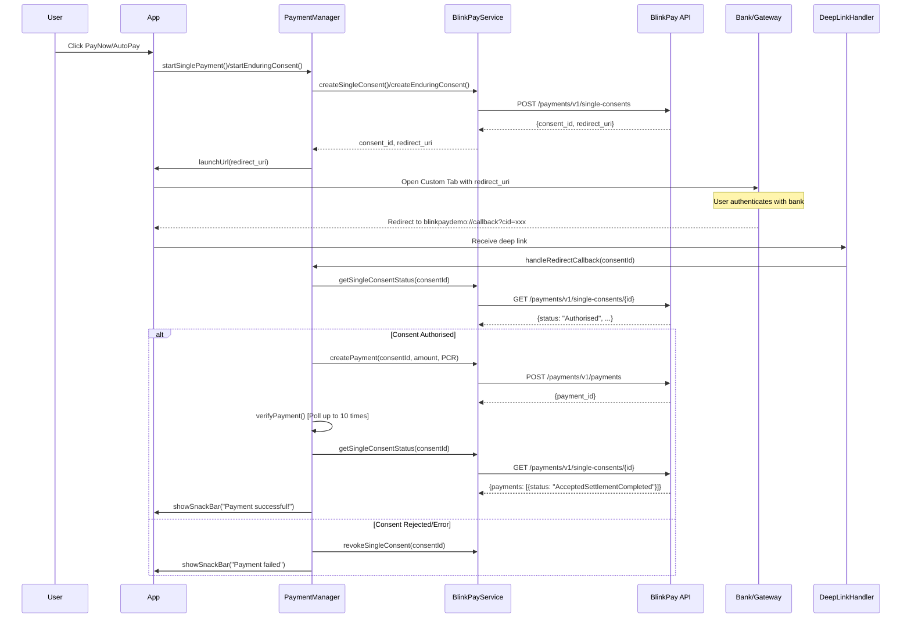

# BlinkPay Flutter Mobile App Demo

## Project Overview

This is a demonstration Flutter mobile application showcasing integration with the **BlinkPay payment gateway** (New Zealand payment service). The app simulates an e-commerce shopping cart where users can purchase items using either:

- **PayNow**: Single one-time payments
- **AutoPay**: Enduring/recurring payment consents

The app demonstrates a complete payment flow including consent creation, bank authorization via Custom Tabs/Safari View Controller, deep linking for redirects, and payment verification.

**Environment**: Sandbox (for testing)
**Target Platforms**: iOS (13.0+), Android
**Primary Language**: Dart/Flutter

## Architecture

### Architecture Pattern

The application uses a **Hybrid Architecture** combining several patterns:

1. **ChangeNotifier Pattern** for reactive state management
2. **Service Layer Pattern** for API communication
3. **Manager Pattern** for business logic orchestration
4. **State Machine Pattern** for payment flow management

### Directory Structure

```
lib/
├── main.dart                    # App entry point and main UI screen
├── blinkpay_service.dart       # BlinkPay API integration layer
├── constants.dart              # App-wide constants (product, PCR codes)
├── env.dart                    # Environment configuration (singleton)
│
├── handlers/
│   └── deep_link_handler.dart  # Listens for payment redirect deep links
│
├── managers/
│   └── payment_manager.dart    # Payment state orchestrator (ChangeNotifier)
│
├── models/
│   └── shopping_cart_model.dart # Shopping cart state (ChangeNotifier)
│
├── utils/
│   ├── log.dart                # Centralized logging
│   └── payment_error_helper.dart # User-friendly error messages
│
└── widgets/
    ├── loading_overlay.dart    # Full-screen loading indicator
    ├── payment_buttons.dart    # PayNow/AutoPay action buttons
    ├── product_card.dart       # Product display with quantity controls
    └── status_indicator.dart   # AppBar payment status icon
```

### State Management

**Two ChangeNotifier Classes:**

1. **PaymentManager** (`lib/managers/payment_manager.dart:457`)
   - Manages payment state machine with 5 states: `idle`, `creatingConsent`, `awaitingRedirect`, `verifying`, `error`
   - Orchestrates entire payment flow from creation to completion
   - Handles consent creation, status checking, payment verification
   - Provides UI callbacks for navigation and user feedback

2. **ShoppingCartModel** (`lib/models/shopping_cart_model.dart:73`)
   - Manages cart quantity and total calculation
   - Simple state: quantity integer, total calculation
   - Reactive updates trigger UI rebuilds

**State Flow:**
```
main.dart (StatefulWidget)
├── Listens to PaymentManager (setState on notify)
├── Listens to ShoppingCartModel (setState on notify)
└── Passes UI callbacks to PaymentManager
```

## Key Components

### 1. BlinkPayService (`lib/blinkpay_service.dart:438`)

**Responsibilities:**
- OAuth2 token management with automatic refresh
- All BlinkPay API HTTP requests
- Token caching to minimize auth requests

**Key Methods:**
- `createSingleConsent()` - Create one-time payment consent
- `createEnduringConsent()` - Create recurring payment consent
- `createPayment()` - Execute payment against authorized consent
- `getSingleConsentStatus()` / `getEnduringConsentStatus()` - Poll consent status
- `revokeSingleConsent()` / `revokeEnduringConsent()` - Cancel consent

**API Configuration:**
- Base URL: `sandbox.debit.blinkpay.co.nz` (configurable via `.env`)
- Auth: OAuth2 Client Credentials flow
- Headers: `Content-Type: application/json`, `Authorization: Bearer <token>`

### 2. PaymentManager (`lib/managers/payment_manager.dart:457`)

**Responsibilities:**
- Central coordinator for all payment operations
- Maintains payment state machine
- Orchestrates BlinkPayService calls
- Manages consent lifecycle (creation → authorization → payment → verification)

**Payment States:**
```dart
enum PaymentState {
  idle,              // No active payment
  creatingConsent,   // Creating consent with BlinkPay API
  awaitingRedirect,  // Waiting for user to return from bank auth
  verifying,         // Verifying payment completion
  error             // Error occurred
}
```

**Key Methods:**
- `startSinglePayment()` - Initiate one-time payment flow
- `startEnduringConsent()` - Initiate recurring consent flow
- `handleRedirectCallback()` - Process deep link after bank auth
- `verifyPayment()` - Poll and verify payment completion (max 10 attempts)

### 3. DeepLinkHandler (`lib/handlers/deep_link_handler.dart:61`)

**Responsibilities:**
- Listen for incoming deep links using `app_links` package
- Parse redirect URLs from BlinkPay (format: `blinkpaydemo://callback?cid=xxx&error=...`)
- Extract consent ID and error parameters
- Notify main app of redirect events

**URL Scheme:** `blinkpaydemo://callback`

### 4. Main Screen (`lib/main.dart:358`)

**Responsibilities:**
- App initialization (timezone, environment, dependencies)
- Main shopping cart UI
- App lifecycle management (paused/resumed states)
- Coordinate PaymentManager, DeepLinkHandler, and UI components

**UI Structure:**
- AppBar with status indicator
- Product card with image and quantity controls
- Payment buttons (PayNow/AutoPay)
- Loading overlay during operations
- Snackbar notifications for results

## Payment Flow

### Complete Payment Sequence



### State Transitions

```
idle → creatingConsent → awaitingRedirect → verifying → idle (success)
                                                      ↓
                                                    error → idle
```

## Important Patterns & Conventions

### 1. Callback Injection Pattern

PaymentManager requires UI callbacks to be injected during payment operations:

```dart
// Example from main.dart
await _paymentManager.startSinglePayment(
  amount: amount,
  launchUrl: (url) async {
    await launchUrl(url, LaunchMode.externalNonBrowserApplication);
  },
  showSnackBar: (message) {
    ScaffoldMessenger.of(context).showSnackBar(
      SnackBar(content: Text(message)),
    );
  },
  handleError: (error) {
    // Error handling logic
  },
);
```

**Why?** Decouples business logic from UI concerns, enables testability.

### 2. PCR (Particulars, Code, Reference)

BlinkPay requires PCR details for bank statement reconciliation:

```dart
// lib/constants.dart
const pcr = PCR(
  particulars: 'Lollies',
  code: 'LollyStore',
  reference: 'Order',
);
```

Sent with every payment request to identify the transaction.

### 3. Polling with Retry Logic

Payment verification uses polling with exponential retry:

```dart
// From payment_manager.dart
const maxAttempts = 10;
const pollInterval = Duration(seconds: 1);

for (int attempt = 1; attempt <= maxAttempts; attempt++) {
  final status = await _blinkPayService.getSingleConsentStatus(consentId);
  if (status.payments.any((p) => p.status == 'AcceptedSettlementCompleted')) {
    return true; // Success
  }
  if (attempt < maxAttempts) {
    await Future.delayed(pollInterval);
  }
}
// Timeout after 10 attempts
```

### 4. Automatic Consent Revocation

Single consents are revoked on timeout/error to prevent orphaned consents:

```dart
// Enduring consents are NOT revoked (they're reusable)
if (isSingleConsent && hasError) {
  await _blinkPayService.revokeSingleConsent(consentId);
}
```

### 5. iOS Safari Auto-Dismissal

Custom native Swift code in `ios/Runner/AppDelegate.swift:49` automatically dismisses SFSafariViewController when deep link is received:

```swift
func dismissSafariViewControllerIfPresent() {
  // Finds and dismisses SFSafariViewController
  // Improves UX by removing manual "Done" tap requirement
}
```

## Environment Configuration

### Required Environment Variables (`.env`)

```bash
BLINKPAY_CLIENT_ID=<your_client_id>
BLINKPAY_CLIENT_SECRET=<your_client_secret>
BLINKPAY_HOSTNAME=sandbox.debit.blinkpay.co.nz  # Optional, defaults to sandbox
```

### Configuration Singleton (`lib/env.dart:28`)

```dart
class Env {
  static final Env _instance = Env._internal();
  factory Env() => _instance;

  String get blinkPayHostname => _env['BLINKPAY_HOSTNAME'] ?? 'sandbox.debit.blinkpay.co.nz';
  String get clientId => _env['BLINKPAY_CLIENT_ID']!;
  String get clientSecret => _env['BLINKPAY_CLIENT_SECRET']!;
}
```

**Validation:** App crashes on startup if required vars are missing.

## Deep Linking Setup

### Android Configuration

`android/app/src/main/AndroidManifest.xml:61`

```xml
<intent-filter>
    <action android:name="android.intent.action.VIEW" />
    <category android:name="android.intent.category.DEFAULT" />
    <category android:name="android.intent.category.BROWSABLE" />
    <data android:scheme="blinkpaydemo" />
</intent-filter>
```

### iOS Configuration

`ios/Runner/Info.plist`

```xml
<key>CFBundleURLTypes</key>
<array>
    <dict>
        <key>CFBundleURLSchemes</key>
        <array>
            <string>blinkpaydemo</string>
        </array>
    </dict>
</array>
```

**IMPORTANT:** The redirect URI must be whitelisted in the BlinkPay Merchant Portal:
- URL: `blinkpaydemo://callback`
- Portal: https://merchants.blinkpay.co.nz/settings/api

## Error Handling

### Error Categories (`lib/utils/payment_error_helper.dart:41`)

1. **Authentication Errors**: "Failed to authenticate. Please check your credentials."
2. **Network/Timeout Errors**: "Connection timed out. Please check your internet."
3. **Browser Launch Errors**: "Failed to open browser."
4. **Generic Errors**: "An error occurred: {message}"

### Error Flow

```
Error occurs
  ↓
PaymentManager catches exception
  ↓
Calls handleError(error) callback
  ↓
UI displays user-friendly message via Snackbar
  ↓
State transitions to PaymentState.error
  ↓
User can retry or cancel
```

## Development Guidelines

### Adding New Payment Types

1. Add API method to `BlinkPayService`
2. Add state management to `PaymentManager`
3. Add UI trigger in `main.dart`
4. Update constants if needed

### Logging

Use centralized logger (`lib/utils/log.dart:42`):

```dart
Log.debug('Debug message');
Log.info('Info message');
Log.error('Error message');
```

Output format: `[HH:mm:ss] 🔍 Debug message`

### Testing Payment Flows

1. Ensure `.env` has valid sandbox credentials
2. Run app: `flutter run`
3. Add items to cart
4. Click PayNow or AutoPay
5. Use BlinkPay sandbox test credentials
6. Monitor logs for API calls and state transitions

### Common Commands

```bash
# Install dependencies
flutter pub get
cd ios && pod install && cd ..

# Run in debug mode
flutter run

# Build for release
flutter build apk  # Android
flutter build ios  # iOS

# Run tests
flutter test
```

## Known Limitations

1. **iOS Minimum Version**: Requires iOS 13.0+ for Safari auto-dismissal
2. **Sandbox Only**: App is configured for BlinkPay sandbox environment
3. **Single Product**: Demo only shows one product (Red Heart Lollipop)
4. **No Persistence**: Cart and payment state don't persist across app restarts
5. **Polling Timeout**: Payment verification times out after 10 attempts (10 seconds)

## Key Dependencies

| Package | Version | Purpose |
|---------|---------|---------|
| `flutter_custom_tabs` | ^2.2.1 | Opens BlinkPay URLs in Custom Tabs/SafariVC |
| `app_links` | ^6.4.0 | Handles incoming deep links |
| `http` | ^1.2.2 | HTTP client for API requests |
| `flutter_dotenv` | ^5.2.1 | Environment variable management |
| `timezone` | ^0.10.0 | Timezone handling for API timestamps |
| `intl` | ^0.20.2 | Date formatting |

## Useful References

- **BlinkPay API Docs**: https://docs.blinkpay.co.nz/
- **Merchant Portal**: https://merchants.blinkpay.co.nz/
- **Flutter Custom Tabs**: https://pub.dev/packages/flutter_custom_tabs
- **App Links**: https://pub.dev/packages/app_links

## Quick Code Navigation

### Starting Points for Common Tasks

- **Modifying payment flow**: `lib/managers/payment_manager.dart:457`
- **Adding API endpoints**: `lib/blinkpay_service.dart:438`
- **Changing UI**: `lib/main.dart:358`
- **Deep link handling**: `lib/handlers/deep_link_handler.dart:61`
- **Error messages**: `lib/utils/payment_error_helper.dart:41`
- **Product/pricing config**: `lib/constants.dart:9`
- **Environment setup**: `lib/env.dart:28`

## File Statistics

- **Total Dart files**: 13
- **Total lines of code**: ~1,900
- **Main components**: 4 (BlinkPayService, PaymentManager, DeepLinkHandler, Main)
- **Widget components**: 4
- **Utility modules**: 2
- **Models**: 1
