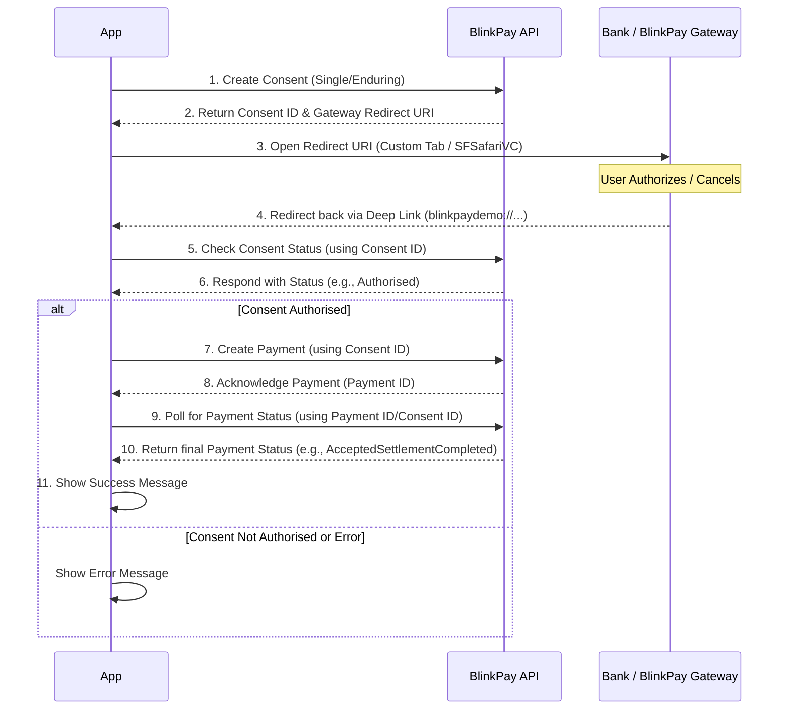

# BlinkPay Flutter Mobile App Demo

A Flutter project showcasing how to integrate e-commerce functionality with the BlinkPay payment gateway. This project demonstrates a mobile implementation of BlinkPay's payment system using `flutter_custom_tabs` and deep linking for seamless payment flow.

## Features

*   Add/remove items from a shopping cart.
*   Initiate Single Payments via BlinkPay Gateway flow.
*   Initiate Enduring Consents via BlinkPay Gateway flow.
*   Handle payment redirects using deep linking (`flutter_custom_tabs` and `uni_links`).
*   Display payment status updates.
*   Basic error handling.
*   Automatic dismissal of `SFSafariViewController` on iOS upon deep link reception (See Native iOS Modifications).

## Prerequisites

Ensure you have the following installed:

*   Flutter SDK (latest stable version)
*   Android Studio or VS Code with Flutter extensions
*   Xcode (for iOS development, macOS only)
*   Git
*   A BlinkPay Sandbox Account (for testing payments)
*   **Minimum iOS Version:** This project requires a minimum iOS deployment target of 13.0 due to native code used for automatically dismissing the Safari view controller. This should be configured automatically by the included Xcode project settings.

## Getting Started

### Installation

1.  **Clone the Repository:**
    ```bash
    git clone <repository-url>
    cd blinkpay_flutter_mobile_app_demo
    ```

2.  **Install Dependencies:**
    ```bash
    flutter pub get
    ```
    If developing for iOS, also run:
    ```bash
    cd ios
    pod install
    cd ..
    ```

### Configuration

#### BlinkPay Configuration

1.  Log into the [BlinkPay Merchant Portal](https://merchants.blinkpay.co.nz/settings/api) (Sandbox environment).
2.  Navigate to your app under Settings/API.
3.  Add your Redirect URI `blinkpaydemo://callback` to your whitelist redirect URLs and save.
4.  Copy the Client ID (API key).
5.  Generate a new secret using "Rotate Secret" and copy it immediately.

#### Environment Configuration

Create a `.env` file in the root of the project with your BlinkPay Sandbox credentials:

```
BLINKPAY_CLIENT_ID=<your_blinkpay_client_id>
BLINKPAY_CLIENT_SECRET=<your_blinkpay_secret>
# Optional: Specify the BlinkPay API hostname if not using production
# BLINKPAY_HOSTNAME=sandbox.blinkpay.co.nz 
```

### Deep Linking Setup

For the payment redirect flow to return the user to the app correctly, you need to configure platform-specific deep linking. This demo uses the custom URL scheme `blinkpaydemo://callback`.

#### Android (`android/app/src/main/AndroidManifest.xml`)

Ensure the following `<intent-filter>` exists inside the `<activity>` tag for `.MainActivity`:

```xml
<activity ... >
    <!-- ... other intent filters ... -->

    <!-- Add/Verify this filter -->
    <intent-filter>
        <action android:name="android.intent.action.VIEW" />
        <category android:name="android.intent.category.DEFAULT" />
        <category android:name="android.intent.category.BROWSABLE" />
        <!-- Accepts URIs that begin with blinkpaydemo:// -->
        <data android:scheme="blinkpaydemo" />
    </intent-filter>
</activity>
```

Also ensure the following are present under the `<manifest>` tag:
```xml
<uses-permission android:name="android.permission.INTERNET"/>

<queries>
    <intent>
        <action android:name="android.intent.action.VIEW" />
        <category android:name="android.intent.category.BROWSABLE" />
        <data android:scheme="https" />
    </intent>
</queries>
```

#### iOS (`ios/Runner/Info.plist`)

Ensure the `CFBundleURLTypes` key exists in your `Info.plist` file:

```xml
<key>CFBundleURLTypes</key>
<array>
    <dict>
        <key>CFBundleTypeRole</key>
        <string>Editor</string>
        <key>CFBundleURLSchemes</key>
        <array>
            <!-- Your chosen URL scheme -->
            <string>blinkpaydemo</string>
        </array>
    </dict>
</array>
```

## Payment Flow

This diagram illustrates the typical sequence of events when making a payment using the BlinkPay gateway integration in this demo app:



## Native iOS Modifications

### SFSafariViewController Auto-Dismissal

To improve the user experience on iOS and make it more consistent with Android's Chrome Custom Tabs behaviour, native Swift code has been added to automatically dismiss the `SFSafariViewController` when the BlinkPay redirect (using the `blinkpaydemo://` custom URL scheme) is received by the application.

*   **Purpose:** Prevents the user from needing to manually tap "Done" or "Cancel" on the Safari view after completing or cancelling the payment flow.
*   **Location:** The relevant code resides in `ios/Runner/AppDelegate.swift`. It overrides the `application(_:open:options:)` method to intercept the URL and includes a helper function `dismissSafariViewControllerIfPresent` to find and dismiss the view controller.
*   **Compatibility:** The code uses `#available` checks to ensure compatibility with the project's iOS 12 deployment target.

This modification allows the Flutter application to handle the deep link payload while the native layer takes care of closing the web view seamlessly.

## Running the Application

Ensure you have an emulator running or a device connected.

Run the app in debug mode:

```bash
flutter run
```

## Libraries Used

*   `flutter_custom_tabs`: For launching the web URLs in a platform-idiomatic way (Chrome Custom Tabs on Android, SFSafariViewController on iOS).
*   `uni_links`: For handling incoming deep links (custom URL schemes).
*   `flutter_dotenv`: For managing environment variables from a `.env` file.
*   `http`: For making HTTP requests to the BlinkPay API.
*   `timezone`: For date/time handling (required by BlinkPay API).
*   `ChangeNotifier`: Used within `PaymentManager` for state management, notifying listeners to trigger UI updates via `setState`.

## Contributing

Contributions are welcome. Please follow standard fork and pull request workflows.

## License

This project is licensed under the MIT License - see the LICENSE file for details.