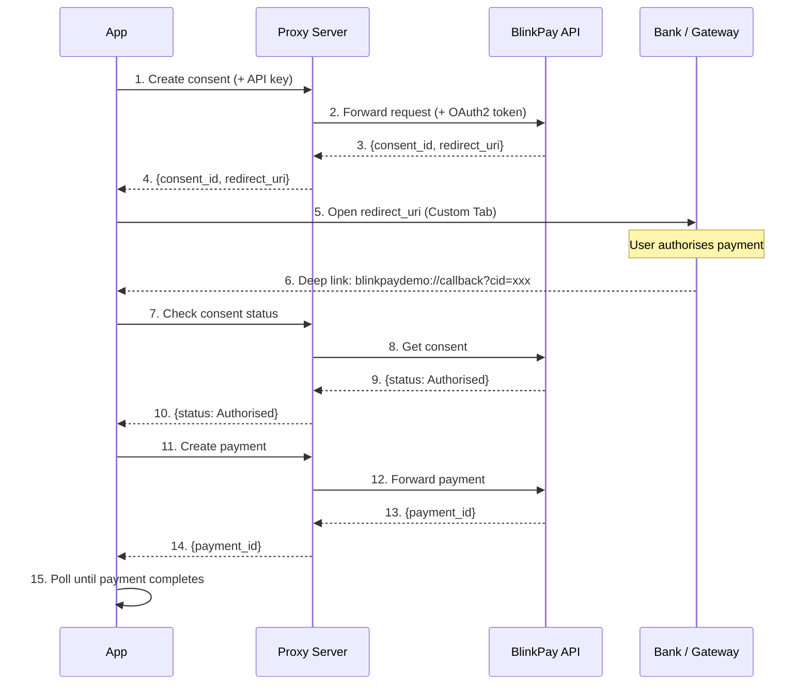

# BlinkPay Flutter Mobile App Demo

A demo showing how to accept payments with [BlinkPay](https://www.blinkpay.co.nz) from a Flutter mobile app. The project contains two parts:

| Project | Directory | Purpose |
|---|---|---|
| **Flutter App** | Root (`lib/`) | Shopping cart UI that initiates payments and handles bank redirects |
| **Proxy Server** | `server/` | Dart Shelf backend that holds BlinkPay API credentials and forwards requests |

The app never sees BlinkPay secrets — all API calls go through the proxy server, which manages OAuth2 tokens and authenticates with BlinkPay on the app's behalf.

## Features

- Shopping cart with quantity controls
- Single payments (PayNow) via BlinkPay Gateway flow
- Enduring consents (AutoPay) via BlinkPay Gateway flow
- Bank redirect handling via deep links (`flutter_custom_tabs` + `app_links`)
- Payment status polling and display
- Backend proxy that keeps `client_id` / `client_secret` server-side

## Prerequisites

- Flutter SDK (latest stable)
- Dart SDK (included with Flutter)
- A BlinkPay Sandbox account — [Merchant Portal](https://merchants.blinkpay.co.nz/settings/api)
- Android Studio or VS Code with Flutter extensions
- Xcode (for iOS, macOS only) — minimum iOS 13.0

## Quick Start

```bash
git clone <repository-url>
cd blinkpay_flutter_mobile_app_demo
flutter pub get
cp server/.env.example server/.env
# Edit server/.env with your BlinkPay sandbox credentials (see below)
./run.sh
```

The script installs server dependencies, prompts for your target device, starts the proxy server, and launches the Flutter app. You can skip the prompt with `./run.sh --simulator`, `--emulator`, or `--lan`.

### BlinkPay credentials

Edit `server/.env` with your sandbox credentials:

```
BLINKPAY_API_URL=sandbox.debit.blinkpay.co.nz
BLINKPAY_CLIENT_ID=your_client_id_here
BLINKPAY_CLIENT_SECRET=your_client_secret_here
APP_API_KEY=                              # Leave empty — run.sh will auto-generate one
SERVER_PORT=4567
```

To get these: log into the [BlinkPay Merchant Portal](https://merchants.blinkpay.co.nz/settings/api), go to Settings > API, add `blinkpaydemo://callback` to your redirect URIs, copy the Client ID, and rotate/copy the secret.

<details>
<summary>Manual setup (without run.sh)</summary>

**Terminal 1 — Start the server:**

```bash
cd server && dart pub get && dart run bin/server.dart
```

**Terminal 2 — Start the Flutter app:**

```bash
flutter run \
  --dart-define=BACKEND_URL=http://10.0.2.2:4567 \
  --dart-define=APP_API_KEY=your_api_key_from_server_env
```

Use the appropriate `BACKEND_URL` for your device:

| Device | `BACKEND_URL` |
|---|---|
| Android Emulator | `http://10.0.2.2:4567` |
| iOS Simulator | `http://localhost:4567` |
| Physical device (USB or same network) | `http://<your-lan-ip>:4567` |

To find your LAN IP: `ipconfig getifaddr en0` (macOS) or `hostname -I` (Linux).

</details>

## Payment Flow


```mermaid
sequenceDiagram
    participant App
    participant Proxy as Proxy Server
    participant BP as BlinkPay API
    participant Bank as Bank / Gateway

    App->>Proxy: 1. Create consent (+ API key)
    Proxy->>BP: 2. Forward request (+ OAuth2 token)
    BP-->>Proxy: 3. {consent_id, redirect_uri}
    Proxy-->>App: 4. {consent_id, redirect_uri}
    App->>Bank: 5. Open redirect_uri (Custom Tab)
    Note over Bank: User authorises payment
    Bank-->>App: 6. Deep link: blinkpaydemo://callback?cid=xxx
    App->>Proxy: 7. Check consent status
    Proxy->>BP: 8. Get consent
    BP-->>Proxy: 9. {status: Authorised}
    Proxy-->>App: 10. {status: Authorised}
    App->>Proxy: 11. Create payment
    Proxy->>BP: 12. Forward payment
    BP-->>Proxy: 13. {payment_id}
    Proxy-->>App: 14. {payment_id}
    App->>App: 15. Poll until payment completes
```

Deep links (`blinkpaydemo://callback`) go directly from the bank back to the app — they don't pass through the proxy.

## Security Notes

> **This is a demo using BlinkPay's sandbox environment.** It demonstrates the correct architecture for mobile-to-BlinkPay integration. App-to-server auth is simplified for demo purposes.

**What the demo gets right:**
- BlinkPay `client_id` and `client_secret` are held server-side only
- The app binary contains zero BlinkPay secrets
- API calls are proxied through the backend
- App-to-server auth is demonstrated via a shared API key

**What production apps should add:**
- Proper app-to-server authentication (OAuth2, JWT, session tokens)
- HTTPS/TLS between app and backend (this demo uses HTTP)
- Rate limiting, request validation, and input sanitisation on the server
- Hosted backend deployment (not localhost)
- Secrets manager for server-side credentials

## Deep Linking Setup

After the user authorises a payment at their bank, BlinkPay redirects back to the app via a custom URL scheme (`blinkpaydemo://callback` in this demo). This requires platform-specific configuration that you'll need to replicate in your own project.

### Flutter dependencies

Add these to your `pubspec.yaml`:

```yaml
dependencies:
  flutter_custom_tabs: ^2.5.0   # Opens bank redirect in Chrome Custom Tab / SFSafariViewController
  app_links: ^7.0.0             # Listens for incoming deep links
```

### Android — `android/app/src/main/AndroidManifest.xml`

Add an intent filter inside your `<activity>` tag so Android routes your scheme to the app:

```xml
<activity android:name=".MainActivity" android:launchMode="singleTop" ... >
    <!-- Deep linking -->
    <intent-filter>
        <action android:name="android.intent.action.VIEW" />
        <category android:name="android.intent.category.DEFAULT" />
        <category android:name="android.intent.category.BROWSABLE" />
        <data android:scheme="your_scheme" android:host="callback" />
    </intent-filter>
</activity>
```

Also add under `<manifest>` to allow opening HTTPS URLs in Custom Tabs:

```xml
<uses-permission android:name="android.permission.INTERNET"/>

<queries>
    <intent>
        <action android:name="android.intent.action.VIEW" />
        <category android:name="android.intent.category.BROWSABLE" />
        <data android:scheme="https" />
    </intent>
</queries>
```

> **Note:** `android:launchMode="singleTop"` is important — without it, the deep link may open a second instance of your activity instead of returning to the existing one.

### iOS — `ios/Runner/Info.plist`

Register your URL scheme so iOS routes it to the app:

```xml
<key>CFBundleURLTypes</key>
<array>
    <dict>
        <key>CFBundleTypeRole</key>
        <string>Editor</string>
        <key>CFBundleURLSchemes</key>
        <array>
            <string>your_scheme</string>
        </array>
    </dict>
</array>
```

### iOS — `ios/Runner/AppDelegate.swift` (auto-dismiss Safari)

When the bank redirects back, `SFSafariViewController` stays on screen unless explicitly dismissed. Without this, users have to manually tap "Done". Add this to your `AppDelegate`:

```swift
import SafariServices

override func application(_ app: UIApplication, open url: URL,
                          options: [UIApplication.OpenURLOptionsKey : Any] = [:]) -> Bool {
    if url.scheme == "your_scheme" && url.host == "callback" {
        DispatchQueue.main.asyncAfter(deadline: .now() + 0.1) {
            self.dismissSafariViewControllerIfPresent()
        }
    }
    return super.application(app, open: url, options: options)
}

func dismissSafariViewControllerIfPresent() {
    guard let windowScene = UIApplication.shared.connectedScenes
              .compactMap({ $0 as? UIWindowScene })
              .first(where: { $0.activationState == .foregroundActive }),
          let rootVC = windowScene.windows.first(where: { $0.isKeyWindow })?.rootViewController else { return }

    var topVC = rootVC
    while let presented = topVC.presentedViewController { topVC = presented }

    if let safariVC = topVC as? SFSafariViewController {
        safariVC.dismiss(animated: true)
    }
}
```

> **Note:** The 0.1s delay ensures the app is fully foregrounded before attempting to dismiss. Requires iOS 13.0+ deployment target (for `connectedScenes`).

### BlinkPay redirect URI

Whatever scheme you choose, register it as a redirect URI in the [BlinkPay Merchant Portal](https://merchants.blinkpay.co.nz/settings/api) under Settings > API. The URI must match exactly (e.g. `your_scheme://callback`).

## Project Structure

```
.
├── lib/                              # Flutter app
│   ├── main.dart                     # Entry point and main UI
│   ├── blinkpay_service.dart         # HTTP client (calls proxy, NOT BlinkPay)
│   ├── env.dart                      # Config from --dart-define (no secrets)
│   ├── constants.dart                # App constants
│   ├── handlers/
│   │   └── deep_link_handler.dart    # Deep link listener
│   ├── managers/
│   │   └── payment_manager.dart      # Payment flow state machine
│   ├── models/
│   │   └── shopping_cart_model.dart  # Cart state
│   ├── utils/
│   │   ├── log.dart                  # Logging utility
│   │   └── payment_error_helper.dart # Error formatting
│   └── widgets/
│       ├── loading_overlay.dart      # Loading spinner overlay
│       ├── payment_buttons.dart      # PayNow / AutoPay buttons
│       ├── product_card.dart         # Product display with cart controls
│       └── status_indicator.dart     # Payment status icon
├── server/                           # Dart Shelf proxy server
│   ├── bin/server.dart               # Server entry point
│   ├── lib/src/
│   │   ├── config.dart               # Server config from .env
│   │   ├── blinkpay_client.dart      # BlinkPay API client (OAuth2 tokens)
│   │   ├── middleware/
│   │   │   └── auth_middleware.dart   # API key validation
│   │   └── routes/
│   │       ├── consent_routes.dart   # Consent proxy endpoints
│   │       └── payment_routes.dart   # Payment proxy endpoints
│   ├── .env                          # Server secrets (git-ignored)
│   ├── .env.example                  # Template
│   └── pubspec.yaml                  # Server dependencies
├── run.sh                            # Start server + app together
├── pubspec.yaml                      # Flutter app dependencies
└── README.md
```

## License

This project is licensed under the MIT License — see the LICENSE file for details.
